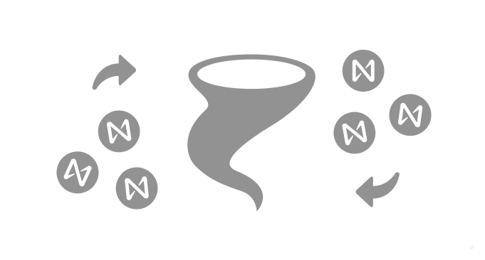
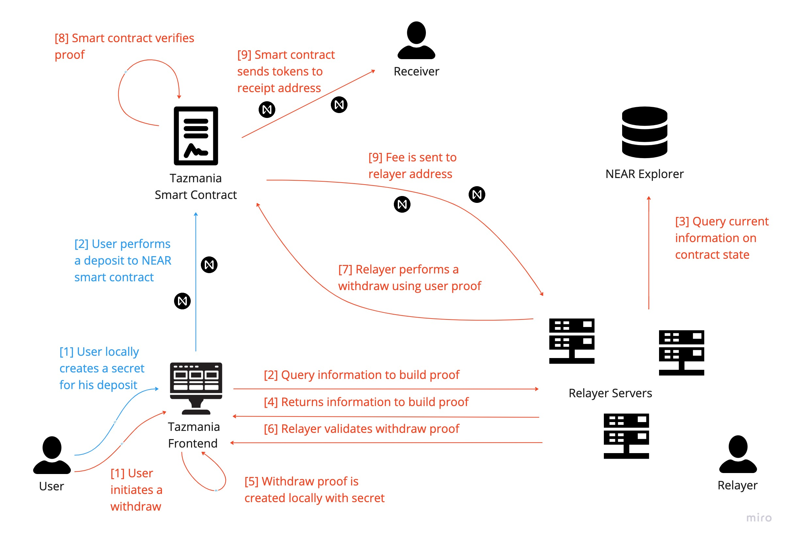

<h1 align="center">Tazmania</h1>

    

### This is an example cryptocurrency tumbler using zk-snarks on the NEAR protocol. This project was created for educational purposes to practice NEAR development and zk-snarks.

Zero Knowledge Proofs have been a gateway to many amazing use cases, from anonymity to scaling solutions. ZKPs allow us to expand the horizon of use cases within the NEAR dapp ecosystem, however, the resources to get started are not readily available.

The purpose of this project is to showcase a workflow which brings a ZKP application to life on NEAR's native blockchain.

---
<h2 align="center">What is a mixer</h2>

Due to the full transparency of the blockchain, users transactional activity is public information. Mixers enable complete dissasociation between deposits and withdraws therefore allowing its user's funds to be sent descretley to other addresses. 

Although mixers have come into scrutiny by government bodies (i.e. Tornado Cash), they are an important step towards a world which promotes user ownership and privacy.

---
<h2 align="center">How It Works</h2>

There are three major components at play: *frontend*, *relayer* and *smart contract*.

### The frontend
The actual platform users only interact through the frontend. It provides the tools to locally create secret phrases, proofs, preform deposit smart contract calls and interact with relayer nodes.

### The Smart Contract
The smart contract serves as the backend of our tumbler. It maintains the tokens deposited, verifies proofs before withdraws and distributes the value to receipients and relayers.

### The relayer servers
Relayer servers play a central role in the anonimity of the architecture. Since withdraws are esentially smart contract calls, a NEAR account must call these calls and pay the required gas. The caveat here is that if a user is to withdraw himself, he is either prone to reveal his identity by using the same account he used for deposit, or fund an alternate account to call the withdraw (usually identifying such concetivity is relatively easy). That is why it is best to have a third party account to perform the withdraw using a completley dissasociated address from the depositer. As incentive for running relayer nodes, relayer accounts receive a certain fee from every successful withdraw, and since the proofs presented to the relayers include the receipient address, we can ensure relayers can not tamper with the withdraw requester's  intentions.

*For more information on each one of these components, check the relevant README files.*

    

The above diagram shows the processes involved for a deposit (*blue*) and a withdraw (*red*).

---

<h1 align="center">How To Run</h1>

---

## TODO

- Account encoding for verification on smart contract and zk.
- Incorporate fee check into proof.
- Add sender id to frontend.
- Display relayer fee before approving withdraw.
- Error checking in frontend and relayer.

## How to Run

Go 
