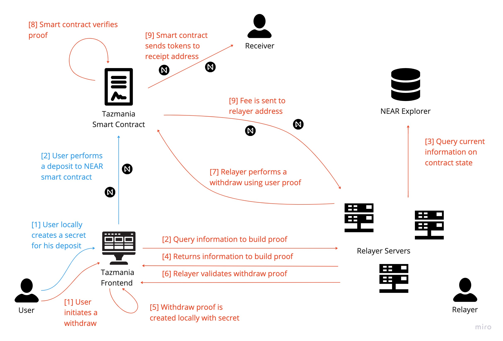

<h1 align="center">Tazmania</h1>

    

### This is an example tumbler using zk-snark on the near protocol. This project was created for educational purposes to practice NEAR development and zk-snarks.

Zero Knowledge Proofs have been a gateway to so amazing use cases, from anonymity to scaling solutions. ZKPs allow us to expand the horizon of use cases within the NEAR dapp ecosystem, however, the resources to get started are still non existent.

The purpose of this project to showcase a workflow which brings a ZKP application to life on NEAR's native blockchain.

---
<h2 align="center">What is a mixer</h2>

Due to the full transparency of the blockchain, users transactional activity is public information. Mixers enable complete dissasociation between deposits and withdraws therefore allowing its user's funds to be sent descretley to other addresses. 

Although mixers have come into scrutiny by government bodies (i.e. Tornado Cash), they are an important step towards a world which promotes, user ownership and privacy.

---
<h2 align="center">How It Works</h2>

    

There are three major components at play: *frontend*, *relayer* and *smart contract*.

### The frontend
The actual platform users only interact through the frontend. 

---

<h1 align="center">How To Run</h1>

## TODO

- Account encoding for verification on smart contract and zk.
- Incorporate fee check into proof.
- Add sender id to frontend.
- Display relayer fee before approving withdraw.
- Error checking in frontend and relayer.

## How to Run

Go 
